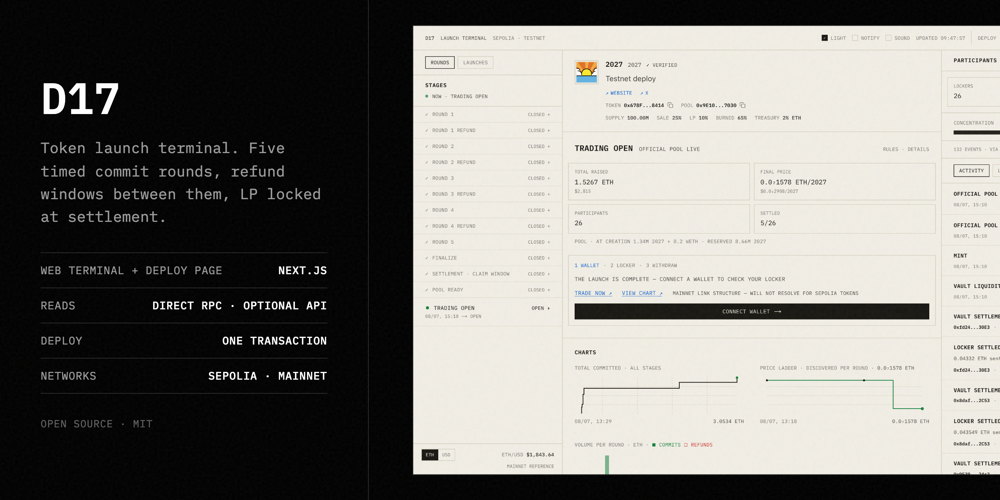
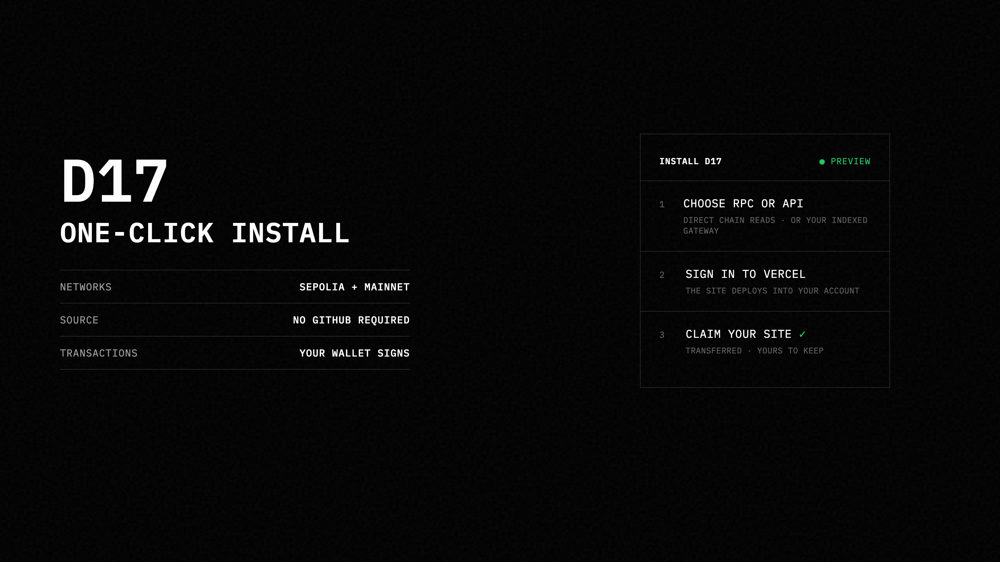

# D17



**An open-source Ethereum launch mechanism with published rules, personal
participant lockers, explicit refund windows and permanently locked
liquidity.**

D17 was shaped around [@xbt2027's vision](https://x.com/xbt2027): a token
launch should not depend on participants trusting promises made off-chain.
The schedule, exits, supply treatment, settlement and liquidity path should be
visible before anyone commits and then enforced by contracts rather than an
operator's discretion.

This repository is the complete runnable release: participant terminal,
wallet deployer, optional RPC-backed API, Solidity contracts, public
deployment manifests, tests and documentation. One application supports both
Sepolia and Ethereum mainnet through the `TESTNET | MAINNET` switch.

> **Experimental software:** D17 has extensive local and Sepolia test evidence
> but has not received a formal professional third-party audit. Mainnet uses
> real ETH and WETH. Review the contracts, launch settings and every wallet
> transaction independently.

## Deploy the web app on Vercel

[][d17-vercel-deploy]

[][d17-vercel-deploy]

### Install it in five clear steps

> **Start here:** click the large image above or the small **Deploy with
> Vercel** button directly beneath it. Both open the same official Vercel
> setup page. You do not need to download this repository or run a command.

1. Click either installation link above.
2. Sign in to Vercel. If Vercel asks you to connect GitHub, GitLab or
   Bitbucket, follow that prompt so it can create your editable copy.
3. Choose the account that should own the copy. You may keep the suggested
   project and repository names.
4. For a first testnet installation, leave the pre-filled settings unchanged.
   They select Sepolia and public Direct RPC endpoints. You can replace those
   endpoints with compatible RPC URLs that you control.
5. Click **Deploy**, wait for the build to finish, then click **Visit**. The
   resulting site includes the participant terminal, the `TESTNET | MAINNET`
   switch and the `/deploy` page.

This creates a personal copy of the standalone web application in **Direct
RPC mode**. Vercel pre-fills public Sepolia and mainnet RPC endpoints, and you
can replace them with any compatible endpoints before deploying. The web app
includes the participant terminal and `/deploy`; wallet transactions still go
directly from the browser wallet to the selected chain.

The button does **not** deploy the optional indexed API and does not grant
access to D17's temporary hosted infrastructure. No seed phrase, private key,
database or D17 API credential is requested.

## Start locally in five steps

The simplest setup reads Ethereum directly from an RPC endpoint. It needs no
D17 server, database, API key from this project or wallet private key.

### 1. Install the requirements

- [Node.js](https://nodejs.org/) 22.13 LTS or Node.js 24+
- Git
- A browser wallet for transactions
- An HTTP Ethereum JSON-RPC endpoint for the network you want to use

### 2. Clone and install

```bash
git clone https://github.com/0xlocker/D17.git
cd D17
npm ci
```

### 3. Create your local configuration

```bash
cp apps/web/.env.example apps/web/.env.local
```

Open `apps/web/.env.local`. For a first Sepolia run, keep RPC mode selected and
replace the Sepolia HTTP placeholder with an endpoint you control:

```text
NEXT_PUBLIC_D17_DATA_MODE=rpc
NEXT_PUBLIC_D17_DEFAULT_NETWORK=sepolia
NEXT_PUBLIC_D17_SEPOLIA_RPC_URL=https://your-sepolia-rpc.example
```

The WebSocket RPC value is optional but improves live updates. If you only have
an HTTP endpoint, clear the unused placeholder so the application does not try
to connect to it:

```text
NEXT_PUBLIC_D17_SEPOLIA_RPC_WS_URL=
NEXT_PUBLIC_D17_MAINNET_RPC_WS_URL=
```

Add mainnet HTTP and WebSocket endpoints only when you are ready to use
mainnet.

### 4. Start D17

```bash
npm run dev:rpc
```

Open [http://127.0.0.1:3000](http://127.0.0.1:3000).

### 5. Explore or deploy

- Use `TESTNET | MAINNET` in the top navigation to select a network.
- Open a launch to follow its rounds, refunds, settlement and pool activity.
- Open `/deploy` to configure a launch. The page simulates `createLaunch`
  against your selected RPC before your wallet signs and submits it.

Display reads use the RPC endpoint you supplied. Transactions always go from
your browser wallet directly to the selected chain. The application never asks
for a seed phrase or private key.

## What is included

### Participant terminal

- Discovers registered D17 launches on Sepolia and mainnet.
- Shows the complete lifecycle: scheduled rounds, refund windows,
  finalization, settlement, pool readiness and trading.
- Displays published rules, tokenomics, raise totals, discovered prices,
  participant concentration, official-pool composition and contract links.
- Streams commits, refunds, settlement and liquidity activity as it happens.
- Shows a connected wallet's locker, position, claim and withdrawal state.
- Supports optional ETH/USD display pricing while keeping ETH canonical.
- Reconciles live updates after sleeping tabs, missed socket messages and
  time-based phase boundaries.

### Launch deployer

- Builds a launch against the canonical factory and shipped ABI.
- Configures token metadata, supply allocation, treasury terms, five round
  shares, schedule, minimums and the global refund penalty.
- Shows the participant-facing result before deployment.
- Validates factory limits and the exact supply split before signing.
- Simulates the transaction through the configured RPC, then asks the wallet
  to sign `createLaunch` directly.
- Requires no hosted D17 API to deploy.

### Two display-data modes

- **Direct RPC:** the browser reads contracts and factory logs from RPC
  endpoints you provide. This is the smallest independent setup.
- **Indexed API:** the included read-only service builds local JSON indexes
  from any compatible RPC and serves REST snapshots plus WebSocket updates.
  It requires no wallet key or external database.

There is no silent fallback between modes. Changing data mode is explicit and
does not change how transactions are signed.

### Complete protocol release

- All production Solidity source and interfaces.
- Factory and per-launch ABIs.
- Sepolia and mainnet deployment manifests.
- Contract, API and browser-state regression tests.
- ABI traceability, source provenance and release checksums.
- Human guides, technical references and self-hosting instructions.

## How the D17 mechanism works

### 1. Rules are published once

A deployer chooses the schedule, token allocation, treasury terms, round
shares, refund penalty, minimums and unsold-token treatment before deployment.
The factory validates the configuration, and the launch records a canonical
rules hash. Those settings cannot be edited after seeing demand.

### 2. Participants use personal lockers

Each participant commits through their own `D17Locker`. Committed WETH remains
in that locker until it is refunded or settled. The website and launch creator
do not receive a function that can withdraw participant locker funds.

### 3. Five rounds discover the outcome

D17 launches have five timed rounds. Round 1 establishes the anchor and must
meet the published floor. Later rounds use the resulting price structure, and
unsold allocations roll according to the fixed contract rules.

### 4. Refund windows provide defined exits

Rounds 1-4 have refund windows. Rounds 1-2 are penalty-free; rounds 3-4 use the
launch's published global refund penalty; round 5 has no normal refund window.
If the launch fails its floor, remaining commitments can be reclaimed in full.

### 5. Finalization and settlement are permissionless where needed

Anyone can finalize a successful launch after the rounds end. Participants can
settle and claim their own positions, and after the contract-computed grace
boundary anyone can trigger settlement for a known locker without redirecting
its tokens or residual WETH. That boundary accounts for both finalization time
and the scheduled trading time. One absent participant cannot permanently hold
a successful launch hostage.

### 6. Liquidity is placed beyond creator control

The official pool receives settled liquidity and the matching token share. LP
tokens are minted to `D17LiquidityVault`, which has no withdrawal path for the
official LP position. If a locker settles after pool creation, its reserved
token share and liquidity WETH are added atomically to the same official pair,
with the resulting LP again held by the vault.

## What the contracts enforce

- Token supply is minted once; minting closes and token ownership is
  renounced.
- Sale, liquidity, deployer and dead-token allocations must sum to the total
  supply.
- A deployer allocation is bounded and fixed to the launch creator.
- Tokens cannot circulate normally before the official pool opens.
- Refund costs and treasury terms are published before commitment.
- Failed launches return remaining commitments without a refund penalty.
- Finalization, post-grace settlement and pool creation cannot depend on an
  operator remaining online.
- Official LP tokens cannot be withdrawn by the creator or application.
- Existing launches are not upgradeable in place.

These rules reduce specific custody and operator risks. They do not guarantee
that a token has value, that its economics are attractive, that external
contracts cannot fail or that the source contains no defects.

## Optional indexed API mode

The included API is useful when you want fast snapshots and one shared index
instead of asking every browser to scan RPC logs independently.

It is a separate, self-hosted service under `apps/api`. It runs from any
compatible Ethereum RPC endpoint you configure; it is not created by the
Vercel button above and it does not depend on D17's private infrastructure.

```bash
cp apps/api/.env.sepolia.example apps/api/.env.sepolia
cp apps/api/.env.mainnet.example apps/api/.env.mainnet
# Add working RPC endpoints to both API profile files.

cp apps/web/.env.example apps/web/.env.local
# Set NEXT_PUBLIC_D17_DATA_MODE=api in apps/web/.env.local.

npm run dev:api
```

`npm run dev:api` starts both profiles, using port `8787` for Sepolia and
`8788` for mainnet. Run one API profile independently with
`npm run api:sepolia` or `npm run api:mainnet`.

API mode changes display reads only. Launch creation, commitments, refunds,
settlement, pool creation and withdrawals remain wallet-to-chain actions.

## Repository map

```text
apps/web       Participant terminal and wallet deployer
apps/api       Optional RPC indexer, REST API and WebSocket server
contracts      Solidity source, tests, ABIs and deployment tools
deployments    Public Sepolia and mainnet factory manifests
docs           User, technical and self-hosting documentation
release        Reproducible protocol build inputs and artifacts
```

## Contracts and verification

```bash
npm run typecheck
npm run test:api
npm run test:contracts
npm run test:guard
npm run check:release
```

Compile or regenerate ABI artifacts separately with:

```bash
npm run compile -w @d17/contracts
npm run build:abi -w @d17/contracts
```

The public factory manifests are in `deployments/` and
`contracts/deployments/`. Read [the contract README](./contracts/README.md)
before compiling, verifying or deploying another suite.

## Documentation

- [Start with the user guide](./docs/GUIDE.md)
- [Contracts explained in plain language](./docs/CONTRACTS.md)
- [Technical contract reference](./docs/CONTRACTS_TECHNICAL.md)
- [Self-hosting guide](./docs/SELF_HOSTING.md)
- [API operations](./apps/api/OPERATIONS.md)
- [Security policy](./SECURITY.md)
- [Source integrity and provenance](./SOURCE_INTEGRITY.md)
- [Release verification](./VERIFICATION.md)
- [Standalone documentation repository](https://github.com/0xlocker/d17-docs)
- [Contracts-only repository](https://github.com/0xlocker/d17-contracts)

## Network safety

- The selected URL includes `?network=sepolia` or `?network=mainnet`.
- Changing networks performs a full navigation and discards old-network
  sockets, timers, requests and selected launch state.
- API responses and WebSocket metadata are checked against the selected chain.
- Deployment simulation RPCs and browser wallets are chain-checked before
  signing.
- Mainnet uses real assets even when the interface looks identical to testnet.

## License and scope

D17 is released under the [MIT License](./LICENSE). It is an experimental
mechanism, reference application and educational project. It is not investment
advice and does not promise token value, market liquidity or freedom from
software defects.

[d17-vercel-deploy]: https://vercel.com/new/clone?repository-url=https%3A%2F%2Fgithub.com%2F0xlocker%2FD17&root-directory=apps%2Fweb&project-name=d17&repository-name=d17&env=NEXT_PUBLIC_D17_DATA_MODE%2CNEXT_PUBLIC_D17_DEFAULT_NETWORK%2CNEXT_PUBLIC_D17_SEPOLIA_RPC_URL%2CNEXT_PUBLIC_D17_MAINNET_RPC_URL%2CNEXT_PUBLIC_D17_SEPOLIA_EXPLORER_BASE%2CNEXT_PUBLIC_D17_MAINNET_EXPLORER_BASE%2CNEXT_PUBLIC_SITE_MODE%2CNEXT_PUBLIC_ENABLE_DEPLOY%2CNEXT_PUBLIC_ENABLE_TEST_CONTROLS%2CNEXT_PUBLIC_ENABLE_USD&envDefaults=%7B%22NEXT_PUBLIC_D17_DATA_MODE%22%3A%22rpc%22%2C%22NEXT_PUBLIC_D17_DEFAULT_NETWORK%22%3A%22sepolia%22%2C%22NEXT_PUBLIC_D17_SEPOLIA_RPC_URL%22%3A%22https%3A%2F%2Fsepolia.drpc.org%22%2C%22NEXT_PUBLIC_D17_MAINNET_RPC_URL%22%3A%22https%3A%2F%2Feth.drpc.org%22%2C%22NEXT_PUBLIC_D17_SEPOLIA_EXPLORER_BASE%22%3A%22https%3A%2F%2Fsepolia.etherscan.io%22%2C%22NEXT_PUBLIC_D17_MAINNET_EXPLORER_BASE%22%3A%22https%3A%2F%2Fetherscan.io%22%2C%22NEXT_PUBLIC_SITE_MODE%22%3A%22full%22%2C%22NEXT_PUBLIC_ENABLE_DEPLOY%22%3A%22true%22%2C%22NEXT_PUBLIC_ENABLE_TEST_CONTROLS%22%3A%22false%22%2C%22NEXT_PUBLIC_ENABLE_USD%22%3A%22false%22%7D&envDescription=Public+Direct-RPC+settings+for+D17.+No+seed+phrase%2C+private+key%2C+or+D17+API+credential+is+required.
